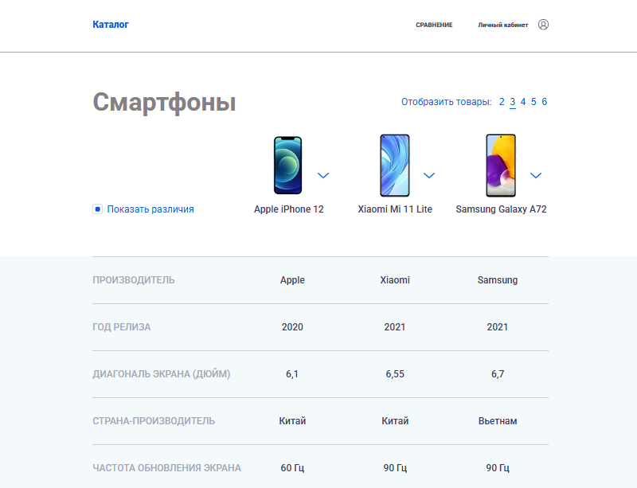

# 🛍 Product Comparison Tool (Vue 3 + TypeScript)

[](https://demo123053782.on247.ru)
[](https://github.com/on247ru/product-compare)

Реализация страницы сравнения товаров для SPA-приложения согласно [дизайн-макету в Figma](https://www.figma.com/file/2PjP1QPRvqx2l2Cpt83efn/Каталог).

## ✅ Выполненные требования

### 1. Базовый функционал
- **Composition API**: Полностью на Vue 3 Composition API + TypeScript
- **UI-библиотеки**: Не использовались (чистый CSS)
- **Адаптивность**: Согласно дизайн-макету

### 2. Сравнение товаров
- Динамический выбор количества товаров (2-6)
- Дефолтное значение: 3 товара
- Автоматическая подстройка под доступное количество

### 3. Система замены товаров
- Модальное окно по клику на ⬇️
- Поиск при >3 товарах (instant search)
- Замена без перезагрузки
- Cкроллбар для >3 товаров

### 4. Фильтр различий
- Чекбокс "Показать различия"
- Динамическая фильтрация характеристик

## 🛠 Технологии
- **Vue 3.5.18** (Composition API + `<script setup>`)
- **TypeScript 5.8.3** (Строгая типизация)
- **Vite 7.1.1** (Сборка + dev-сервер)

## 📦 Установка
```bash
git clone https://github.com/on247ru/product-compare.git
cd product-compare
npm install
npm run dev
```

## 📸 Скриншоты
<div align="center"> </div>

## 📝 Лицензия
MIT License © 2025 on247ru
